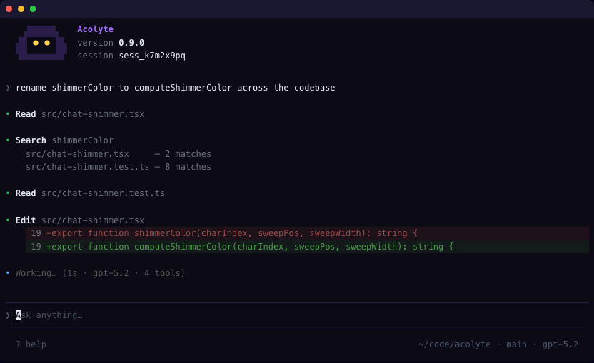

# Acolyte

[](https://github.com/cniska/acolyte/actions/workflows/ci.yml)
[](https://github.com/cniska/acolyte)
[](LICENSE)
[](https://bun.sh)
[](https://www.typescriptlang.org)

A terminal-first AI coding agent: reliable by default, observable, and open source.



## Quick start

```bash
bun install
bun run start init   # prompts for provider API key, writes .env
bun run dev           # starts server + CLI client
```

See all commands: `bun run start help`

## Validate

```bash
bun run verify        # lint + typecheck + all tests
bun test              # all tests
bun run test:unit     # unit tests only
bun run test:int      # integration tests
bun run test:tui      # visual regression tests
bun run test:perf     # performance baselines
```

## Documentation

- [Index](docs/README.md)
- [Why Acolyte](docs/why-acolyte.md)
- [Contributing](CONTRIBUTING.md)
- [Benchmarks](docs/benchmarks.md)
- [Agent policy](AGENTS.md)

## License

[MIT](LICENSE)
