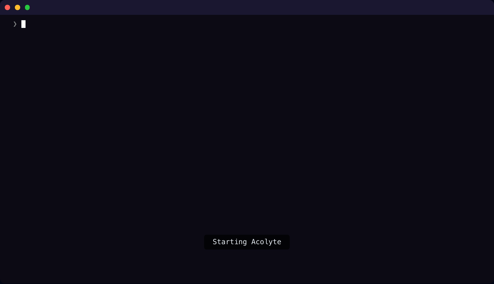

# Acolyte

[](https://github.com/cniska/acolyte/actions/workflows/ci.yml)
[](https://github.com/cniska/acolyte)
[](LICENSE)
[](https://bun.sh)
[](https://www.typescriptlang.org)

The agent that knows you.

Acolyte is an open-source AI coding agent for the terminal. It remembers what it learns about you and your projects from the work itself, so you don't have to explain yourself twice.



## Install

```bash
curl -fsSL https://acolyte.sh/install | sh
```

Or with [Homebrew](https://brew.sh):

```bash
brew install cniska/tap/acolyte
```

Or with npm:

```bash
npm install -g @acolyte/cli
```

Each installs the latest released binary for macOS and Linux, behind a launcher that keeps it up to date automatically — see [Updates](docs/updates.md). Pick one: two installs shadow each other on `PATH`. To run from source instead, see [Local development](#local-development).

Requires Git 2.14 or newer on `PATH`: Acolyte reports every file edit as a Git diff, and `/workspaces` manages Git worktrees.

## Runtime model

```text
CLI → typed RPC → task queue → lifecycle → model + tools
```

- **Daemon:** A persistent server with typed RPC for the CLI, editors, and custom clients.
- **Lifecycle:** Explicit, testable phases, effects, and completion rules.
- **Memory:** Durable session, project, and user context retrieved on demand.
- **Workspace:** Detected project commands and a validated boundary for tool access.
- **Context:** Planned input budgets, bounded tool payloads, and visible token use.
- **Trace:** Local task timelines and structured logs for runtime inspection.

The codebase is TypeScript on Bun, with Zod validation at runtime boundaries and direct dependency injection rather than a container. Read [Architecture](docs/architecture.md) for the component model and [Lifecycle](docs/lifecycle.md) for request execution.

## Local development

Requires [mise](https://mise.jdx.dev) and Git 2.14 or newer.

```bash
git clone https://github.com/cniska/acolyte.git
cd acolyte
mise install
bun install
bun run dev
```

`bun run dev` starts a watch-mode daemon and opens the CLI client. It restarts any local daemon already using the development port, then stops the daemon it started when the client exits.

For daily dogfooding, link the checkout CLI into your PATH:

```bash
mkdir -p ~/.local/bin
ln -sf "$PWD/src/cli.ts" ~/.local/bin/acolyte
```

Use `scripts/install.sh` only when you want the latest released binary instead of the local source checkout.

Provider credentials are not needed to run the test suites. To use the agent against a provider while developing, configure one once for your user account:

```bash
bun run src/cli.ts auth vercel --key
```

This stores the key in Acolyte's private global credentials file. Use `openai`, `anthropic`, or `google` instead to configure a direct provider. See [Configuration](docs/configuration.md) for credential precedence, local models, and provider settings.

## Common commands


| Command                  | Purpose                                                          |
| ------------------------ | ---------------------------------------------------------------- |
| `bun run dev`            | Start the watch-mode daemon and interactive CLI.                 |
| `bun run dogfood`        | Run the local CLI with debug logging against the current source. |
| `bun run run "<prompt>"` | Run a one-shot task from the current source.                     |
| `bun run serve`          | Start only the daemon.                                           |
| `bun run format`         | Format the repository with Biome.                                |
| `bun run verify`         | Run linting, type checking, all tests, and the dependency audit. |


## Testing

Run focused suites while iterating:

```bash
bun test
bun run test:unit
bun run test:int
bun run test:tui
bun run test:perf
```

`bun test` runs every test. `bun run verify` is the required full validation before a pull request. See [Testing](docs/testing.md) for test boundaries, naming, and coverage.

## Repository layout


| Path         | Purpose                                                              |
| ------------ | -------------------------------------------------------------------- |
| `src/`       | CLI, daemon, lifecycle, tools, memory, protocol, and terminal UI.    |
| `docs/`      | Canonical product, runtime, and development documentation.           |
| `scripts/`   | Development, release, test, benchmark, and behavior-harness scripts. |
| `.githooks/` | Hooks installed by `bun install`.                                    |


See [src/README.md](src/README.md) for source-module naming, entry points, test suffixes, and subsystem directories.

Read [AGENTS.md](AGENTS.md) before changing an unfamiliar subsystem. It defines architectural extension points, invariants, and test boundaries.

## Documentation

- [Documentation index](docs/README.md)
- [Architecture](docs/architecture.md)
- [Lifecycle](docs/lifecycle.md)
- [CLI](docs/cli.md)
- [Configuration](docs/configuration.md)
- [Testing](docs/testing.md)


## Contributing

Contributions are welcome. See [CONTRIBUTING.md](CONTRIBUTING.md) and [AGENTS.md](AGENTS.md).

## License

[MIT](LICENSE) © Christoffer Niska
